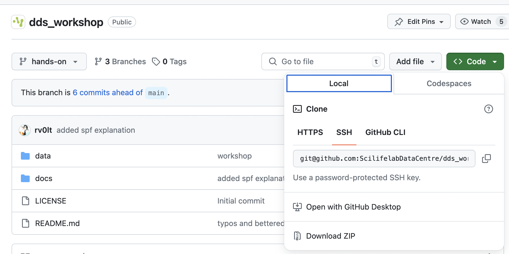

# DDS Unit User's Workshop

This repository contains the instructions for the hands-on sessions during the workshop for SciLifeLab Unit Users
(Autumn 2024).

The documentation for different sessions can be found in the `docs` directory.

## Getting the workshop data

Files used during the workshop are in the `data` directory. 

Before starting, if you have git installed, you can clone this repository to your computer.

~~~
git clone https://github.com/ScilifelabDataCentre/dds_workshop.git
~~~

Otherwise, you can download the materials manually. 

Click on the green button labelled 'Code' and then 'Download ZIP'. 

Unpack/unzip the files locally.